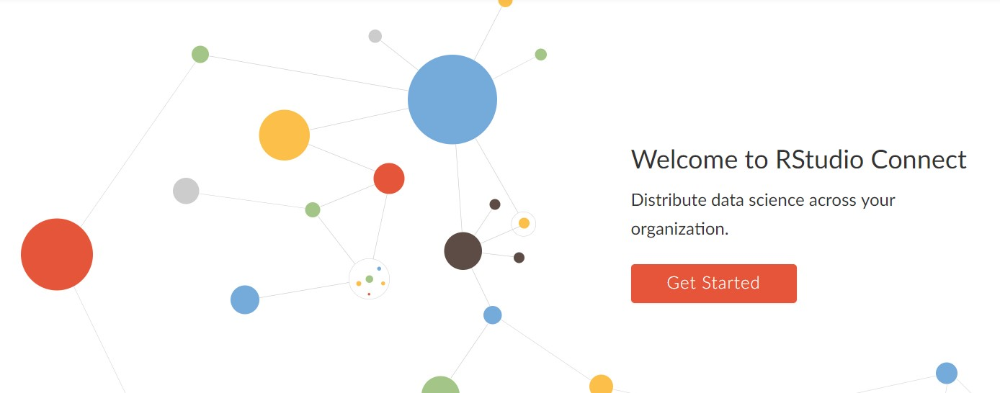

## Quiz: Pre-reqs

Find the Admin guide for RStudio Connect at [https://docs.rstudio.com/](https://docs.rstudio.com/)

Read through section 1 (Introduction), then answer the following questions:

!!! question "Which operating systems are supported for RStudio Connect?"

    * Windows Server 2018
    * Suse Linux
    * Ubuntu
    * Debian
    * Fedora
    * Red Hat
    * CentOS
    
??? example "Answer:"

    The correct answer is: Ubuntu, Suse Linux, Red Hat Linux and CentOS (since it's practically identical to Red Hat).


Remember: R must be installed prior to installing RStudio Connect. (You should have done that earlier!)


## Quiz: Installation

### R version

R must be installed on the system before you start installation of RStudio Connect.

Read the installation section of the admin guide, then answer these questions:

!!! question "What is the minimum R version that is supported on Connect?"
    
    * R-3.0.0
    * R-3.1.0
    * R-3.2.0
    * R-3.3.0
    * R-3.4.0
    * R-3.5.0
    
??? example "Answer:"

    R-3.1.0 is the minimum required version.
    


### Operating system

Before you start the installation on the server, you must note the operating system you are using.

**Hint:** `lsb_release -a`

!!! question "What operating system are you using on the training server?"
    
    * Ubuntu Linux
    * Red Hat Linux


??? example "Answer:"

    The training server is running Ubuntu Linux.
    


## Task: Install RStudio Connect

Follow the instructions for download and installing Connect at :

[https://docs.rstudio.com/rsc/installation/](https://docs.rstudio.com/rsc/installation/)


Hint: Use the folder `/usr/local/src` to store the downloads after the installation.


<asciinema-player src="../../asciicast/install_connect.cast"></asciinema-player>


## Success

How to know you did it?

```sh
sudo tail /var/log/rstudio-connect.log
```

You should see something like this:

```sh
2019/01/10 22:25:07 Using HTTP access log: /var/log/rstudio-connect.access.log
2019/01/10 22:25:07 Sweeping ad-hoc variants
2019/01/10 22:25:07 Starting HTTP listener on :3939
```

The last line means Connect is listening on port 3939


You can also open the connect landing page (from your course login page)




## It's Alive! Can I use it?

Not yet. More choices to make:

* Initial configuration, including email
* Auth Provider

You cover these in the next section


