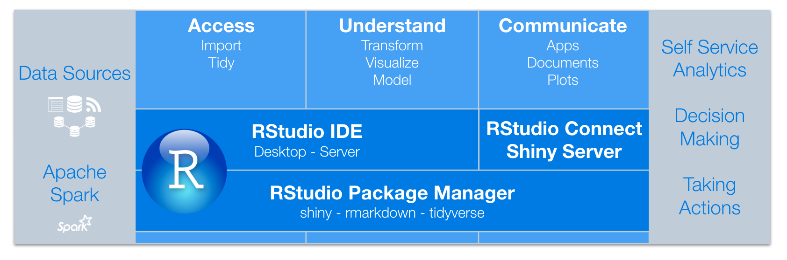

## Session overview

In this session, you will:

* Understand the problems associated with R package management in enterprise environments
* Learn how RStudio Package Manager (RSPM) solves these problems
* Install RSPM on a server

## Introduction

### The problems of R package management

Any R administrator is concerned about distributing R packages to their users.
How can I:

* ensure **reproducibility** of packages for all of my users?
* **centralize** package management for R users across teams?
* serve R packages in an **airgapped** environment?
* allow R users not to worry about **package versions** and availability?
* see which packages and licenses **are in use** in the organization?

RStudio Package Manager allows you to organize and centralize R packages across
your team, department, or entire organization.

* How does RStudio Package Manager address these problems?
* How does RStudio Package Manager fit in with other RStudio products?

### Workflow for using RStudio Package Manager:

* **Administrator installs RSPM on a server**
* Administrator performs configuration on RSPM server
* Administrator creates sources and repositories
* End users connect to repositories and download packages

## Overview

In this course, you will set up RStudio Package Manager as a source of R
packages, then configure RStudio Server Pro and RStudio Connect as consumers of
the packages.

## RSPM documentation and resources

### RSPM documentation and resources

The source of truth about RStudio Package Manager is the admin guide:

[https://docs.rstudio.com/rspm/admin](https://docs.rstudio.com/rspm/admin)

In this course, you will walk through hands-on exercises from the
[Get Started - Installation](https://docs.rstudio.com/rspm/admin/getting-started.html) and
[Get Started - Configuration](https://docs.rstudio.com/rspm/admin/quickstarts.html) sections.

The course also touches upon the remaining sections so you know where to go to get the
information you need after the course.

## Use cases

### Use cases

CRAN has more than 13,000 packages and is updated more than 30 times per day.

RStudio Package Manager helps:

* Administrators maintain R servers without breaking code
* IT centralize packages that meet standards
* Data scientists reproduce results without worrying about packages
* Developers share their code as private packages

RStudio Package Manager can serve packages from various sources:

* CRAN
* Curated CRAN
* Internal Packages
* Packages from Git

### Walkthrough

Let's walk though the basic functionality of RStudio Package Manager:

[https://demo.rstudiopm.com](https://demo.rstudiopm.com)

* View different repositories
* Explore package usage statistics
* Get more details on a specific package in a repository
* Review steps to configure and install packages from a repository

RStudio Package Manager:

* Organizes packages in a central repository
* Performs automatic versioning of the entire repository
* Tracks package usage statistics and metrics
* Integrates with with R, RStudio Server Pro, and RStudio Connect

### Data Science with the RStudio toolchain

RStudio Package Manager provides a centralized solution for managing R packages
for all users within your organization, from development to publishing and
deployment.

## Architecture

### Architecture

RSPM can be used with direct access to CRAN or in air-gapped / offline
installations.

## Requirements

### System requirements

Operating Systems:

* RHEL / CentOS 6+ and 7+
* SUSE 12 SP3+
* Ubuntu 14.04, 16.04, 18.04

Memory: 

* Minimum of 2GB of RAM

Disk requirements:

* Recommended 50 GB to 200 GB of disk storage
* Package sources can be lazily cached from CRAN or eagerly downloaded

View more information on [Configuration and Sizing
Requirements](https://support.rstudio.com/hc/en-us/articles/115002344588-Configuration-and-sizing-recommendations).

### Other requirements

Support for various network setups:

* Direct online access to https://rspm-sync.rstudio.com
* Proxied network access to https://rspm-sync.rstudio.com
* Airgapped / offline systems

Root privileges

* By default, root privileges are required to install, start, stop RSPM and activate license, but there is a `Minimal Root Use` installation path
* By default, RSPM creates and runs under a service account, `rstudio-pm`
* R version 3.0+ is required if you want to build packages from Git
* RSPM currently serves R source packages

## Your turn

### Your turn

Next complete the exercise.

Signs of success:

* RStudio Package Manager is up and running!
