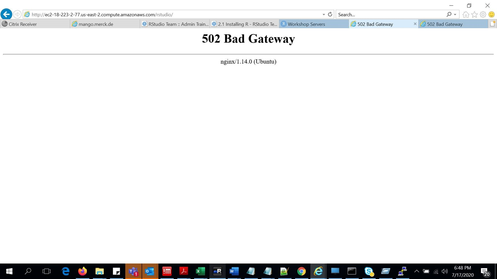

## Permissions errors

!!! tip "You encounter 'Warning: Permission denied' when running a command"

    Symptom: you get a `Warning: Permission denied` 

    This means you tried to do something and the system thinks you have insufficient permissions.

    Since you have root permissions on the VM, but are logged in as `admin-user`, you should use `sudo` to gain elevated privileges.

    For example, if the following instruction throws an error and warning,

    ```sh
    curl ...
    ```

    Then use:

    ```sh
    sudo curl ...
    ```

    Consult a good linux resource for help.  For example, see [Linux Commands For Beginners: SUDO](https://linuxacademy.com/blog/linux/linux-commands-for-beginners-sudo/).

    This will also help you understand the evergreen [XKCD sandwich joke](https://xkcd.com/149/):

    <a href='https://xkcd.com/149/'>
    
    </a>


## 502 Bad gateway error

!!! tip "After claiming your VM, you get a '502 Bad Gateway error'"

    Symptom: you get a `502 Bad Gateway error` when clicking on the RStudio product buttons

    You’re getting a bad gateway error because you’ve not yet configured and installed the products on the VM.  Your task is to install the products and then these links will function.  This is described on the previous page in the sequence (the page where you claimed your VM).
 

    


## General linux shell hints

The course assumes you have some basic linux experience, meaning that you may struggle with some command if you are relatively new to Linux.

If you come across a Linux shell command that you don't understand, and you want to learn more, then you could consult online resources.

In particular, we have found [Explain Shell](https://explainshell.com/) very useful.


For example, if you want to know more about the Linux `curl` command, and specifically what the `curl -O` argument does, then type `curl -O` into the ExplainShell explainer:

<a href='https://explainshell.com/'>

</a>

