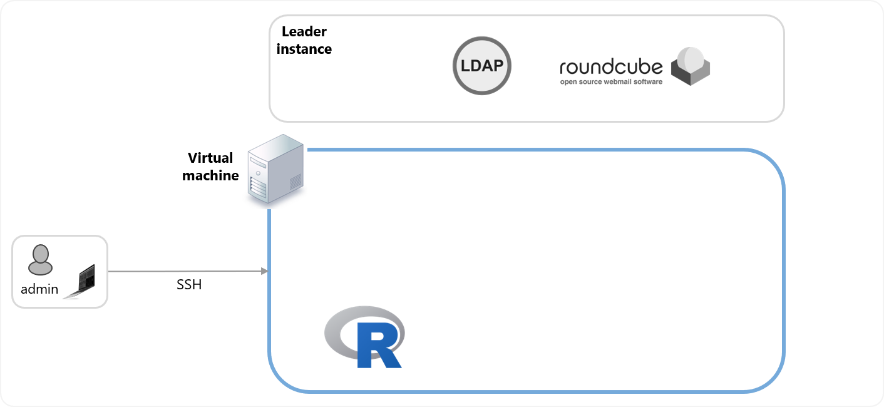
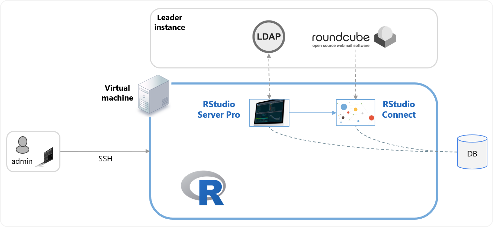

Welcome to the RStudio Team system administration course!

## How this course works

### Initial state

When you start the course, you have a mostly empty virtual machine (VM), inside a virtual private network that also contains a "leader instance". This leader contains a mail server and an LDAP server.  Later during the course you integrate with both.

### Install R from pre-compiled binaries

Your first task is to install R from pre-compiled binaries...

### Install RStudio Server Pro 

... followed by installing RStudio Server Pro.

### Security - configure LDAP 

After installation, you integrate RStudio Server Pro with an authentication mechanism, in this case an LDAP server that is on the leader instance.

### Install and configure RStudio Connect 

After installing RStudio Connect you integrate with a RoundCube mail server (to enable Connect to send email), and you will establish a connection with RStudio Server Pro to deploy content.

### Use RStudio Connect

You will deploy some applications and reports from RStudio Server Pro to Connect, including an app that reads data from a database.

### Install and use RStudio Package Manager

Your final task is to install and configure RStudio Package Manager, and then to establish a connection with RStudio Server Pro.

## Training server logistics

You have access to your own (virtual machine) server with pre-installed R, some R packages, and loaded with necessary demo files and folders. 

During this session you will:

* Get your login credentials for the virtual machine
* SSH into the machine
* Explore the machine, e.g. to find user files, classroom material, etc.

## Your turn

Next complete the exercise.

Signs of success:

  * You can `ssh` into the Virtual Machine
  
