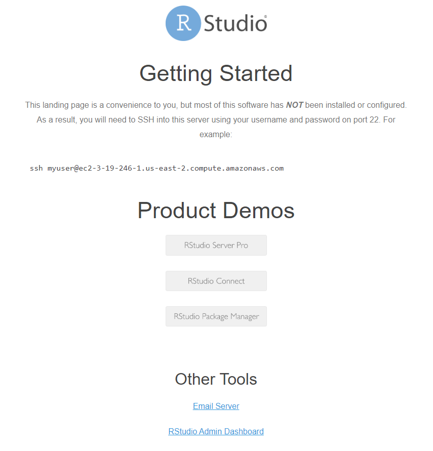
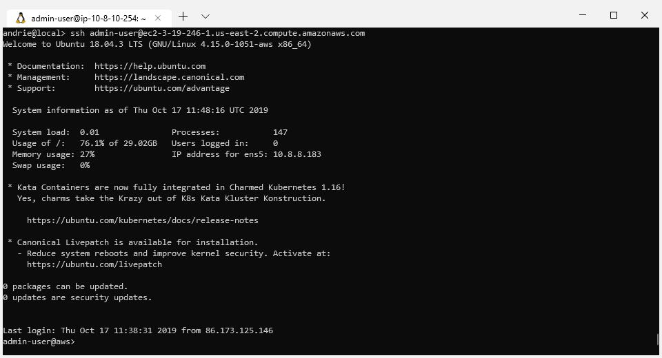

## Task: Get your VM host name and credentials

* Go to the classroom app: [https://rstd.io/class](https://rstd.io/class)
* Enter your classroom password 
* Register with your name and email address

You will get a home screen with a URL, user name and password


* Point your browser browser to the URL you are given


## Task: Open the getting started screen

The screen should look similar to this:




## Task: SSH in

Use the provided credentials to log in

You can do this using your favourite SSH tool, including:

* linux terminal
* git bash
* PuTTy or SuperPutty


In the terminal, use a command like the following (after substituting your own host name):

```sh
ssh admin-user@ec2-99-999-99-999.us-east-2.compute.amazonaws.com
```

This screencast demonstrates how to make the connection:

<asciinema-player src="../../asciicast/ssh.cast"></asciinema-player>


Upon success you should be able to see the Ubuntu initial welcome information:





## Task: Explore some folder locations

Make a mental note of the following folder locations

Location              | Contents
------------          | --------------------
`/usr/share/class`    | classroom material
`/usr/local/src`      | contains pre-downloaded source material
`/opt/R`              | installation folder for R


For example:

```sh
ls /usr/share/class
```

```sh
ls /usr/local/src
```
