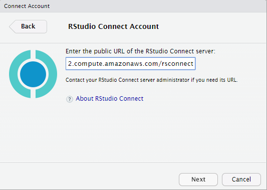
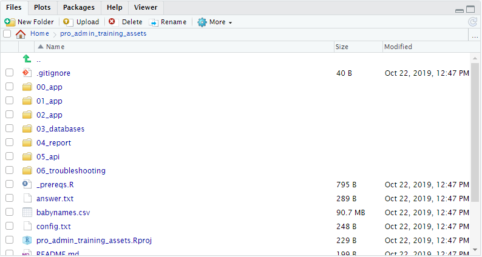

## Task: Allow pop-ups in your browser

When you connect your IDE to Connect, a choreographed **dance** starts.  During this dance you provide your Connect credentials to RStudio Server Pro.

The dance includes a pop-up window that is blocked by most modern browsers.

In the browser tab that contains RStudio Server, configure the browser to allow pop-ups from this site.

Video review:

<video width="100%" controls>
  <source src="https://cdn.rstudio.com/pro-admin/videos/enable_browser_popups.mp4" type="video/mp4">
</video>


## Task: Connect your IDE to Connect


Use the "Global Options" menu in RStudio Server to configure a connection to your Connect instance. You need the host name or IP address.

```
RStudio
  --> Tools
    --> Global Options
      --> Publishing 
        --> Connect
```

Enter: `http://<host_name>/rsconnect`

(Remembering to replace `<host_name>` with the appropriate hostname for your!)




Video review:

<video width="100%" controls>
  <source src="https://cdn.rstudio.com/pro-admin/videos/connect_ide_to_connect.mp4" type="video/mp4">
</video>


## Task: Copy the example apps

**Perform this task from your SSH console**

You can find the example apps for this classroom at `/usr/share/class/class-repo`

```sh
ls -l /usr/share/class/class-repo/
```

**Your task is to copy these files to `jen`'s home folder**

Remember:

* Think carefully about where you are logged in as which user
* You are probably:
    - logged in as `admin-user` in SSH
    - logged in as `jen` in RStudio Server Pro 
  
  
So, with your permissions as the `admin-user`, you must copy the course files to the home folder of the RStudio Server user, and set the file ownership so that `jen` owns these files.

```sh
sudo cp -r /usr/share/class/class-repo/ /home/jen
sudo chown -R jen: /home/jen
```

Alternatively you can use the `Terminal` tab within RStudio Server, which provides you with a terminal session for user `jen`:

```sh
cp -r /usr/share/class/class-repo/ ~
```


```sh
ls -l /home/jen/pro_admin_training_assets/
```

```
total 92960
drwxr-xr-x 2 jen root     4096 Oct 22 11:42 00_app
drwxr-xr-x 2 jen root     4096 Oct 22 11:42 01_app
drwxr-xr-x 2 jen root     4096 Oct 22 11:42 02_app
drwxr-xr-x 2 jen root     4096 Oct 22 11:42 03_databases
drwxr-xr-x 2 jen root     4096 Oct 22 11:42 04_report
drwxr-xr-x 3 jen root     4096 Oct 22 11:42 05_api
drwxr-xr-x 2 jen root     4096 Oct 22 11:42 06_troubleshooting
-rw-r--r-- 1 jen root      199 Oct 22 11:42 README.md
-rw-r--r-- 1 jen root      795 Oct 22 11:42 _prereqs.R
-rw-r--r-- 1 jen root      289 Oct 22 11:42 answer.txt
-rw-r--r-- 1 jen root 95123524 Oct 22 11:42 babynames.csv
-rw-r--r-- 1 jen root      248 Oct 22 11:42 config.txt
-rw-r--r-- 1 jen root      229 Oct 22 11:42 pro_admin_training_assets.Rproj
-rw-r--r-- 1 jen root      847 Oct 22 11:42 rstudio-session-sssd
-rw-r--r-- 1 jen root      471 Oct 22 11:42 rstudio-sssd
-rw-r--r-- 1 jen root     1313 Oct 22 11:42 s-answer.txt
-rw-r--r-- 1 jen root     1258 Oct 22 11:42 s-template.txt
```


## Task: Deploy app_0

Now open RStudio Server Pro and navigate to `~/pro_admin_training_assets` in the files tab (where you are logged in as `jen`)




Do the following

* Navigate to `00_app` and open `app_0.R`
* You may get a ribbon that says "shiny is required but not installed"
    - If you get this banner, click to install the `shiny` package.


  
* Click the "Run App" button 


* Does the app run locally?


* Close the app and return to the code pane


*  Find the "publish" button in the upper-right hand corner of the **code pane**:
  

  
* Click the `publish app` button 

* Publish the app to Connect


  


While the app deploys, observe:

* How long does it take?
* Can you see what happens?

After deployment to Connect:

* Does the app run in Connect?


## Deployment failure?

If you get the following error message during publication, you've clicked the "wrong" publishing button.


It is possible to publish apps in several ways from the IDE:

* From the **code pane**:
    - This method is reliable, and works for any document, regardless of what  file name you gave the document (app or report).
  

  
  
* From the running **shiny app** pane:
    - This method only work in special cases.
    - Specifically, it assumes you named your shiny app `app.R`.

So, to fix this problem, use the publish button in the **code pane**.


## Explore the content settings panel

After successful deployment, a new browser tab will open, with your running Connect app.

Notice that as the publisher you can change some settings for your newly deployed app.

In the top right hand corner of the Connect screen you will see a ribbon of action buttons:


Explore each of these action buttons:

* **Info** provides usage stats for the previous 30 days, and allows you to upload a cover image for the content
* **Access** allows you to change access control and edit the custom URL
* **Runtime** lets you scale a Shiny app to multiple processes (in parallel)
* **Schedule** allows you to run a Report at scheduled times (not applicable for apps)
* **Vars** let's you change environment variables
* **Logs** displays the deployment log and any errors

For more help, refer to the Connect [user guide](https://docs.rstudio.com/connect/user/content-settings/).


## Task: Deploy app_1


### Run and deploy app_1

Now for a more complex example

* Navigate to `01_app` and open `app_1.R`
* Select "Run App"
* Does the app run locally?


  

* Close the running app
* Click the "publish" button in the code pane to deploy the app to Connect.


While the app deploys, observe:

* Can you see what happens?
    - Observe the "Deploy" pane in RStudio Server Pro:

    - Specifically, notice the bundle id and document id
* How long does it take?
    - The deployment process can take several minutes, while Connects installs every R package that was used in the app.

After deployment to Connect:

* Does the app run in Connect?


### Task: Redeploy app_1

Next, take a look at the _redeployment_ process.

To do this, make any trivial change to the code, e.g. by inserting a new line after the `library(...)` statements.

Then save the file and deploy the same app again.

Observe:

* How long does it take to deploy the 2nd time?
    - It should much faster than the first time
    - The reason is that Connect caches R packages, so will fetch from the cache every subsequent time an app uses the same package (and same version of the package)
    - See the Connect admin guide on [package caching](https://docs.rstudio.com/connect/admin/r/package-management/) for more information.

* Does the deployment succeed?


### Task: Browse the local Connect deployment record

Notice that after your deployment, you have a new folder called `rsconnect` in your application folder (in RStudio Server).

* Explore this folder until you find the file `app_01.dcf`.


* Open this file


* Can you recognise:
    - The app title?
    - Your app id?
    - Your bundle id?
    - Your user name, account and server?


## Task: Deploy app_2

### How to diagnose a failed deployment


<video width="100%" controls>
  <source src="https://cdn.rstudio.com/pro-admin/videos/incomplete_deployment.mp4" type="video/mp4">
</video>

### Task: Run app_02

* Attempt to run `02_app/app_02.R` locally

* Note that the execution fails

* The missing package is available in the course materials and can be installed using

```r
install.packages("~/pro_admin_training_assets/packages/rstudiointernal_0.2.0.tar.gz", repos = NULL)
```

* Does the app work locally after installing this package?

### Task: Deploy app_02

* Attempt to deploy `02_app/app_02.R`
* Note that the deployment fails

* Do not try to fix this, but try to spot the failure messages in your own deployment log.


### Ponder: sandboxing on Connect

By inspecting the deployment log, attempt to answer:

* What is going wrong and where?
    - At home?
    - At daycare?
* What are your options for fixing this?


You don't have to fix the issue - just identify the root cause


Answer hints:

* Which package is causing a problem?
* How was this package installed?
* How can you install a private package on Connect?
    - [External Package Installation](https://docs.rstudio.com/connect/admin/r/package-management/#external-package-installation)
* Find some references in the Connect admin guide about internal repos and white listing.
