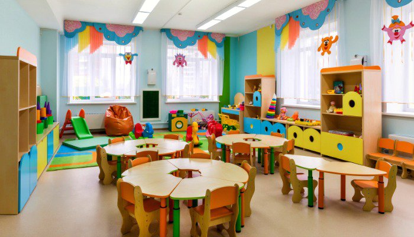
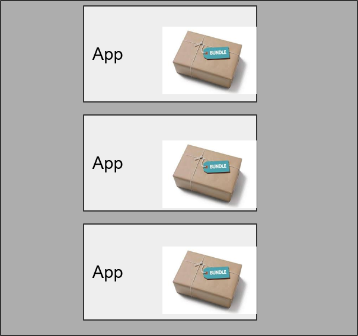
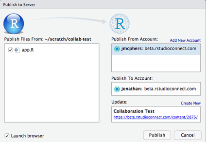
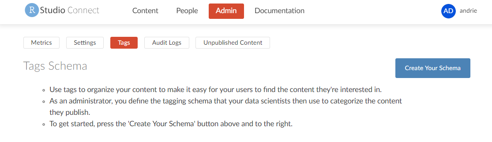

## In this session

In this session you will:

* Connect your RStudio IDE to Connect
* Deploy a simple app
* Discover some other administrator tools


## Connecting the IDE


To deploy content from the IDE to Connect, you first have to set up a connection, i.e. tell the IDE where to find Connect.


`RStudio --> Tools  --> Global Options --> Publishing --> Connect`


Enter your server address: 'http://<host_name>/rsconnect'


### Video: Connecting your IDE to Connect

<video width="100%" controls>
  <source src="https://cdn.rstudio.com/pro-admin/videos/connect_ide_to_connect.mp4" type="video/mp4">
</video>


### Pointing IDE to Connect

What does this do?

* Creates a public / private key pair and stores the key (and token) in a user-specific folder. 		

Why do this?

* When you publish content you have a machine talking to another machine.
* That means you need a non-interactive way to authenticate.
* HINT: This theme will come up again


### Demo

Deploy an app to Connect

* Navigate to `0_app` and open `app_0.R`
* Select "Run App"
* In the upper-right hand corner, "Publish"

???+ Question
    How long did the deployment take?


### That was pretty easy ...

... make a trivial change in the app and deploy again.

???+ Question
    How did this deployment differ from the first?
    Was it faster? Why?


## Understanding failure


Deploying content to Connect is like taking a kid from home to daycare.





* If a problem arises, you must troubleshoot
    - Did the problem happen at home (you forgot it)?
    - Or at daycare (they lost it)?
* There also are different rules at home and daycare.


### Explore some troubleshooting tools

* Deployment Log
* Bundles
* Application Log
* Connect Sandbox 


### Deployment log

```sh
Preparing to deploy application...DONE
Uploading bundle for application: 1...DONE
Deploying bundle: 1 for application: 1 ...
Building Shiny application...
Bundle requested R version 3.4.1; using /usr/lib64/R/bin/R which has version 3.4.1 
2017/12/05 00:15:36.162805962 # Validating R library read / write permissions ------------
2017/12/05 00:15:36.188861769 # Validating packrat installation --------------------------
2017/12/05 00:15:36.189041620 Installed packrat SHA is: 29b1c491b8f90aab40077d011d0077d81a99d7d4 
2017/12/05 00:15:36.189180324 Packaged packrat SHA is:  29b1c491b8f90aab40077d011d0077d81a99d7d4 
2017/12/05 00:15:36.190624677 Packrat is up-to-date. 
2017/12/05 00:15:36.190776099 R version: 3.4.1
2017/12/05 00:15:36.190838996 packrat version: 0.4.8.43
2017/12/05 00:15:36.191408200 # Validating packrat cache read / write permissions --------
2017/12/05 00:15:36.307287524 Audited package hashes with local packrat installation. 
2017/12/05 00:15:36.310763166 # Installing required R packages withpackrat::restore()` ---
2017/12/05 00:15:36.491569335 Installing BH (1.65.0-1) ...  
2017/12/05 00:15:43.453766543 Caching BH. 
2017/12/05 00:15:45.498690843 Using cached BH. 
2017/12/05 00:15:45.645180957 	OK (built source) 
2017/12/05 00:15:45.645525390 Installing MASS (7.3-47) ...  
2017/12/05 00:15:53.866638423 Caching MASS. 
2017/12/05 00:15:53.891269915 Using cached MASS. 
2017/12/05 00:15:53.892713176 	OK (built source) 
2017/12/05 00:15:53.892966963 Installing R6 (2.2.2) ...  
2017/12/05 00:15:55.248487715 Caching R6. 
2017/12/05 00:15:55.253542270 Using cached R6. 
2017/12/05 00:15:55.254496893 	OK (built source) 
2017/12/05 00:15:55.254752408 Installing RColorBrewer (1.1-2) ...  
2017/12/05 00:15:56.433528568 Caching RColorBrewer. 
2017/12/05 00:15:56.436468956 Using cached RColorBrewer.
2017/12/05 00:15:56.437064457 	OK (built source) 
2017/12/05 00:15:56.437335870 Installing Rcpp (0.12.13) ...
```


## The deployment bundle


### Components of the bundle

* Part 1: Create Bundle on Client
* Part 2: Upload Bundle to RSC
* Part 3: Restore Bundle


### Part 1: Create Bundle on Client


```sh
Preparing to deploy application...DONE
```

### Part 2: Upload Bundle to RSC

```sh
Uploading bundle for application: 1...DONE
Deploying bundle: 1 for application: 1 ...
```

### Part 3: Restore Bundle

```sh
Bundle requested R version 3.4.1; using /usr/lib64/R/bin/R which has version 3.4.1 
2017/12/05 00:15:36.162805962 # Validating R library read / write permissions -------------------------------- 
2017/12/05 00:15:36.188861769 # Validating packrat installation ----------------------------------------------
2017/12/05 00:15:36.189041620 Installed packrat SHA is: 29b1c491b8f90aab40077d011d0077d81a99d7d4 
2017/12/05 00:15:36.189180324 Packaged packrat SHA is:  29b1c491b8f90aab40077d011d0077d81a99d7d4 
2017/12/05 00:15:36.190624677 Packrat is up-to-date. 
2017/12/05 00:15:36.190776099 R version: 3.4.1
2017/12/05 00:15:36.190838996 packrat version: 0.4.8.43
2017/12/05 00:15:36.191408200 # Validating packrat cache read / write permissions ----------------------------
2017/12/05 00:15:36.307287524 Audited package hashes with local packrat installation. 
2017/12/05 00:15:36.310763166 # Installing required R packages withpackrat::restore()` ---------------------
2017/12/05 00:15:36.491569335 Installing BH (1.65.0-1) ...  
2017/12/05 00:15:43.453766543 Caching BH. 
2017/12/05 00:15:45.498690843 Using cached BH. 
2017/12/05 00:15:45.645180957 	OK (built source) 
2017/12/05 00:15:45.645525390 Installing MASS (7.3-47) ...  
2017/12/05 00:15:53.866638423 Caching MASS. 
2017/12/05 00:15:53.891269915 Using cached MASS. 
2017/12/05 00:15:53.892713176 	OK (built source) 
2017/12/05 00:15:53.892966963 Installing R6 (2.2.2) ...  
2017/12/05 00:15:55.248487715 Caching R6. 
2017/12/05 00:15:55.253542270 Using cached R6. 
2017/12/05 00:15:55.254496893 	OK (built source) 
2017/12/05 00:15:55.254752408 Installing RColorBrewer (1.1-2) ...  
2017/12/05 00:15:56.433528568 Caching RColorBrewer. 
2017/12/05 00:15:56.436468956 Using cached RColorBrewer.
2017/12/05 00:15:56.437064457 	OK (built source) 
2017/12/05 00:15:56.437335870 Installing Rcpp (0.12.13) ...
```


### Summary of the bundle

Lots happened during the deployment.

First thing is the deployment log in the IDE: 

1. What is this bundle thing?

2. Application and bundle Id

3. Version of R requested vs used

4. Packages to install


### Bundle: bundle id and app id

The `bundle id` and `app id` contain useful information. 

This is the log for a deployment to an app with  **app id** `2`. Notice the **bundle id** is `5`:

```sh
Discovering document dependencies... OK
Preparing to deploy document...DONE
Uploading bundle for document: 2...DONE
Deploying bundle: 5 for document: 2 ...
Building R Markdown document...
```

The app id (2) corresponds to the app id in Connect (2):


### Redeployment increments the bundle id

Redeploying the app increments the bundle id (in this case to 6).

* (The bundle id is unique across the Connect instance)

```sh
Discovering document dependencies... OK
Preparing to deploy document...DONE
Uploading bundle for document: 2...DONE
Deploying bundle: 6 for document: 2 ...
Building R Markdown document...
```


### Video: viewing the bundle in Connect

<video width="100%" controls>
  <source src="https://cdn.rstudio.com/pro-admin/videos/connect_view_bundle.mp4" type="video/mp4">
</video>


### Viewing the bundle in Connect

You can download the bundle from Connect, and the bundle id corresponds to the information in the deployment log:

!!! note "Notice:"

    * Both bundles `2` and `6` appear in `Source Versions`
    * You can view, download or activate any previous bundle

    


## Understanding what's in the bundle


### Bundle (What are you sending to daycare?)

To understand what happened in RStudio, download the bundle from Connect. 

* Find the "Source versions" button by expanding the `...` pills button

* Then download the bundle


Familiarise yourself with the contents of the `packrat.lock` file and the `manifest.json` file.


### Bundle contents (what's in the bundle?)

1. packrat.lock

  ```
  manifest.json
  PackratFormat: 1.4
  PackratVersion: 0.4.8.1 
  RVersion: 3.4.1
  Repos: CRAN=https://cran.rstudio.com/
  
  Package: BH 
  Source: CRAN 
  Version: 1.65.0-1 Hash: 95f62be4d6916aae14a310a8b56a6475
  ```

2. application code 

3. supporting files (data) 


### Bundle deployment record

Deploying content creates a deployment record in the `rsconnect` folder.


```yml
name: admin_training_overview
title: Admin training: Overview
username: andrie
account: andrie
server: colorado.rstudio.com
hostUrl: https://colorado.rstudio.com:3939/__api__
appId: 1368
bundleId: 14449
url: https://colorado.rstudio.com:3939/admin_training_overview/
when: 1534319482.42767
```

Mostly used to help the IDE identify "re-deploying" scenarios.


Have a look at the contents of the rsconnect folder. 


### Upload (How do you get to daycare?)

The bundle is uploaded via the Connect APIs using either HTTP or HTTPS.

Remember, we're using plain HTTP for this environment, but a production environment should almost certainly use HTTPS.


!!! tip
    Custom SSL certificates can be tricky to deal with. Whether you're using a self-signed certificate or a custom Certificate Authority, please ensure you familiarise yourself with the [Connect SSL documentation](https://docs.rstudio.com/rsc/configuration/ssl-certificates/).


### Restore (What happens at daycare?)

The bundle is unpacked and Connect uses that data to install the required packages.

Essentially, the bundle contains the app itself as well as data about the app environment, eg. R version and packages used.

Connect will compare these to the installed versions of R it knows about as well as it's cache of pre-downloaded packages. Any package versions required and not already in the cache will be downloaded from the package repo.


### Where did the bundle go?

The internal storage architecture of RStudio Connect:


Application files are stored on the server in the data directory. Metadata about the app, eg package versions used, is stored in the database.

This is useful information if you ever need to migrate from using the internal storage and database on a single server, to a shared database and storage for a high availability environment.

To see the RStudio Connect files navigate to `/var/lib/rstudio-connect` and run the `tree` command.


### Restore (What happens at daycare?)

Connect installs packages from repositories.

* Each app has an isolated runtime environment, allowing apps to depend on different versions of packages.

App   |  Package version
:---: | ----------------
1     | `ggplot 0.8.0`
2     | `ggplot 0.1.0`


This is ok!

But it means Connect can't use a system library, because those can only have 1 version of a package.

This is therefore an important architectural consideration that RSC must be able to install packages from CRAN or a CRAN-like repository.


### Restore issues

Most common sources of pain:

* Repository is not available
    - Solution: Set up an offline repository (RStudio Package Manager) 
  
* Package can not be installed due to missing system level dependency. 
    - Solution: Add package to the system library, eg via `apt` or `yum`.
    - Good news is the 80:20 rule applies in that 80% of packages have no system level dependencies.


### Restore (daycare rules are different)

The way that applications are run in the development environment differs from how they're run on connect.

RStudio Connect provides process management which effectively isolates the applications from one another and the host operating system:

* [sandboxing](https://docs.rstudio.com/connect/admin/process-management/#sandboxing)
* isolation for apps with `tmp` [directory masking](https://docs.rstudio.com/connect/admin/process-management/#temp-directory)





## Sandboxing


The Connect admin guide on [sandboxing](https://docs.rstudio.com/connect/admin/process-management/#sandboxing):

> 'The RStudio Connect process runs as the root user. It needs escalated privileges to allow binding to protected ports and to create "unshare" environments that contain the R processes.'

This is why Connect needs to run as root!


### Sandboxing: packages

After uploading the bundle, Connect must be able to find and install all packages used by your app.

Typically Connect will look on CRAN and github for these packages.  However, if you use private packages in your app, you have several options:

* Create an internal, [private repository](https://docs.rstudio.com/connect/admin/r/package-management/#private-repositories)
* Use [external package installation](https://docs.rstudio.com/connect/admin/r/package-management/#external-package-installation)
    - a form of installation override (at your own risk...)
* Use RStudio Package Manager
    - You cover this in the RSPM sections of this course


## "RunAs" User


### Understanding the "RunAs" user

Connect admins can change the `RunAs` user for any deployed app.

Possible values:

* Default rstudio-connect user
    - See [User Account for Processes](https://docs.rstudio.com/connect/admin/process-management/#runas)
* Local service account
* With PAM Authentication, the "logged-in" user
    - See [Current user execution](https://docs.rstudio.com/connect/admin/process-management/#runas) in the connect admin guide


## Redeployment


Re-deployment of apps is substantially faster than the first deployment.

*  The reason is that Connect creates a cache of binary packages.
*  If a package (with matching version) has previously been instaled, then the installation simply retrieves the package from the cache.

Hint: You can see installation from cache in the deployment log


### Define "collaborator"

* Collaborate on application settings 
* Collaborate on code (co-publish)
    - Start by sharing the `rsconnect` folder (most commonly via git or another VCS)



Notice in the image above that the "Publish From Account" and "Publish To Account" are different accounts.


## Content discoverability


### Content search by title

Connect allows you to search for content in several ways. The first is a simple search on content title.


### Tag schema (taxonomy)

* The second way of searching for content on Connect is by using a taxonomy, or tag schema, of tags.


### Creating a tag schema

* The Connect administrator can:
    - view the "Tags" tab in the admin pane
    - create a custom schema
    - the is completely customizable by any Connect administrator




### Tags: tagging content

* Content **publishers** can tag their own content, using the schema that was pre-defined by the admin


### Searching by tag

Content **viewers** can search content by tag.

* The normal access control rules apply, i.e. you can only see what you have access to.


## Vanity URLs


* Vanity URLS are useful to maintain a "static" URL even if you redeploy the content to a different Connect content ID.

* With [PublishersCanManageVanities](https://docs.rstudio.com/connect/admin/appendix/configuration/#Authorization.PublishersCanManageVanities) set to `true` administrators and publishers can create vanity URLs.


Creating a vanity URL


Viewing a vanity URL


## Other content deployment options


### Publishing apps with continuous Integration


The image above shows the "standard" pattern for deploying to Connect. A developer creates an application inside the IDE and when they're happy with it, they push their applcaition code to Connect.

It is possible however, to perform many of the same tasks in a continuous integration tool, such as [Jenkins](https://www.jenkins.io).

The key differences from the "standard" model are:

* Authentication: machine to machine
    - Jenkins needs a key 
* Jenkins must create the bundle.
    - Implies Jenkins must replicate the dev environment with R and packages and so on
* Automated testing
    - You can take advantage of this sort of configuration for a very powerful side effect: Shiny app testing ([`shinytest`](https://rstudio.github.io/shinytest/))

Other resources:
* https://solutions.rstudio.com/deploy/methods/
* https://github.com/slopp/rsc-ci-test
* https://docs.rstudio.com/connect/admin/appendix/ci/


### Publishing apps from git / github


You can also deploy artefacts to Connect directly from a git repository (including github), bypassing the need for a CI/CD tool like Jenkins.

See [Deploying from git repositories](https://solutions.rstudio.com/deploy/methods/#deploying-from-git-repositories) in the admin guide for more information.


## Advanced admin topics


### Managing Connect in an offline environment

You'll need to set up a package repository that Connect can access.

There are several ways to do this, including:

* manually maintaining your own CRAN-like repository with a package like `miniCRAN`
* Maintaining your own CRAN mirror using `rsync`

**The recommended option:**

* [RStudio Package Manager](https://www.rstudio.com/products/package-manager/)


### Backup and migration

Backup:

* SQLite database is backed up automatically 
* Recommend snapshotting the entire Data Directory as well.

Migrations:

* A bit tricker because of all those installed packages that have been cached. 
* Follow the admin guide instructions.


## Your turn

Next complete the exercise in the next section.

Signs of success:

* You have connected your IDE to Connect
* You have published at least one app
* You understand how to read the deployment log and look for errors
