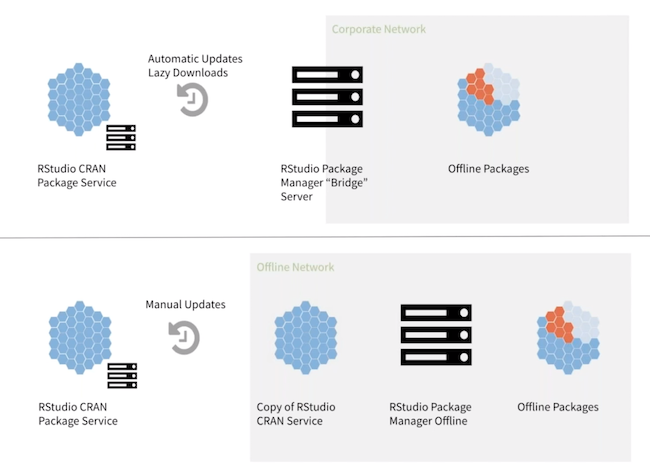

## Session overview

In this session, you will:

* Understand the problems associated with R package management in enterprise environments
* Learn how RStudio Package Manager (RSPM) solves these problems
* Install RSPM on a server
* configure RStudio Workbench and RStudio Connect as consumers of
the packages

## What role does RStudio Package Manager play?

### The problems of R package management

Any R administrator is concerned about distributing R packages to their users.

CRAN has more than 15,000 packages and is updated more than 30 times per day and in addition your users may be creating packages of their own, or using development versions of packages from Github.

Some typical things you might consider include; 

How can I:

* ensure **reproducibility** of packages for all of my users?
* **centralize** package management for R users across teams?
* serve R packages in an **airgapped** environment?
* allow R users not to worry about **package versions** and availability?
* see which packages and licenses **are in use** in the organization?
* speed up package installation across a large number of users?

### Package Manager can help solve these problems

RStudio Package Manager allows you to organize and centralize R package management across
your team, department, or entire organization.

RStudio Package Manager helps:

* Administrators maintain R servers without breaking code
* IT centralize packages that meet standards
* Data scientists reproduce results without worrying about packages
* Developers share their code as private packages
* Introduce CI/CD for internally developed packages
* Save Linux and Windows users from compiling packages from source

RStudio Package Manager can serve packages from various sources:

* CRAN
* Curated CRAN
* Internal Packages
* Packages from Git

You can read more about the benefits of RStudio Package Manager [on our website](https://rstudio.com/products/package-manager/).

## RSPM documentation and resources

The source of truth about RStudio Package Manager is the admin guide:

[https://docs.rstudio.com/rspm/admin](https://docs.rstudio.com/rspm/admin)

In this course, you will walk through hands-on exercises from the
[Get Started - Installation](https://docs.rstudio.com/rspm/admin/getting-started.html) and
[Get Started - Configuration](https://docs.rstudio.com/rspm/admin/quickstarts.html) sections.

The course also touches upon the remaining sections so you know where to go to get the
information you need after the course.

## View a live instance of Package Manager

Let's look at the basic functionality of RStudio Package Manager:

RStudio maintains a public instance of Package Manager which is free to use. The only difference between this and the version that you install youself if that you're not able to use any of the customizations mentioned above. We can use this to view in the interface and see how it looks to an end user. Visit [https://packagemanager.rstudio.com](https://packagemanager.rstudio.com) and explore the following:

* View different repositories
* View package usage statistics
* Get more details on a specific package in a repository
* Review steps to configure and install packages from a repository

RStudio Package Manager:

* Organizes packages in a central repository
* Performs automatic versioning of the entire repository
* Tracks package usage statistics and metrics
* Integrates with with R, RStudio Workbench, and RStudio Connect

### Data Science with the RStudio toolchain

RStudio Package Manager supports all other uses of R within your organization, from development to publishing and
deployment.

## Architecture

RSPM can be used with direct access to CRAN or in air-gapped / offline
installations.

## Requirements

### System requirements

Operating Systems:

* RHEL / CentOS 6+ and 7+
* SUSE 12 SP3+
* Ubuntu 14.04, 16.04, 18.04

Memory: 

* Minimum of 2GB of RAM

Disk requirements:

* Recommended 50 GB to 200 GB of disk storage
* Package sources can be lazily cached from CRAN or eagerly downloaded

View more information on [Configuration and Sizing
Requirements](https://support.rstudio.com/hc/en-us/articles/115002344588-Configuration-and-sizing-recommendations).

### Other requirements

Support for various network setups:

* Direct online access to https://rspm-sync.rstudio.com
* Proxied network access to https://rspm-sync.rstudio.com
* Airgapped / offline systems

Root privileges:

* By default, root privileges are required to install, start, stop RSPM and activate license, but there is a `Minimal Root Use` installation path
* By default, RSPM creates and runs under a service account, `rstudio-pm`

Other useful information:

* R version 3.0+ is required if you want to build packages from Git
* RSPM currently serves R source packages (All platforms) and binary packages (Linux and Windows only)

## Your turn

In the following exercise, you'll install RSPM to your server.

Signs of success:

* RStudio Package Manager is up and running!

