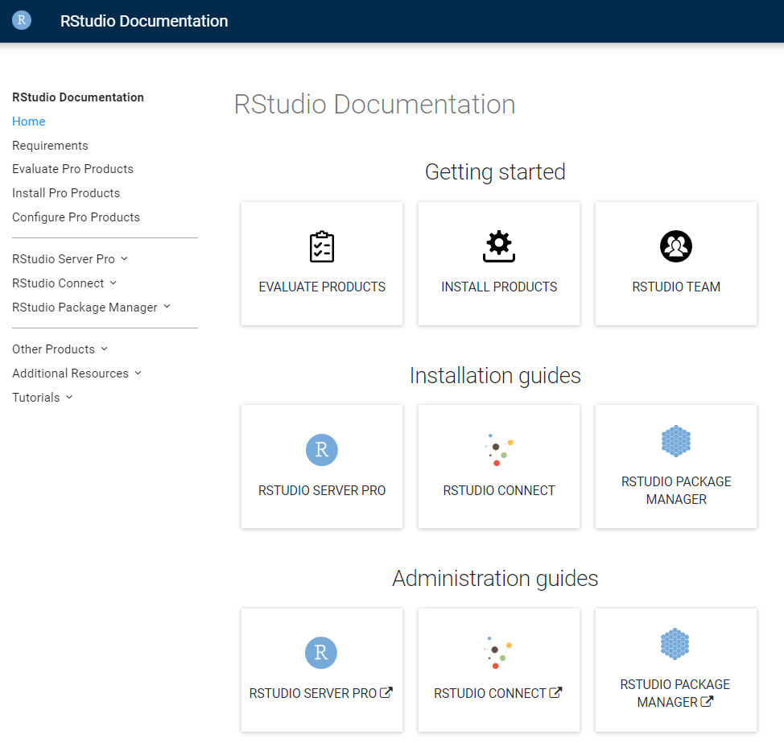
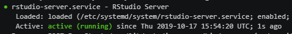
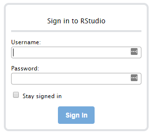

## Review

### General product documentation

Please take a moment to review the RStudio product documentation page:

Please bookmark this page - you will refer to this frequently during the course.

Notice that the documentation page is organized in a logical flow for each product:

* Requirements
* Evaluation
* Installation
* Configuration

[https://docs.rstudio.com](https://docs.rstudio.com)




### RStudio Workbench server requirements

Take a look at the support documents:

* [General product requirements](https://support.rstudio.com/hc/en-us/articles/360015177453-RStudio-professional-product-requirements)
* [RStudio Workbench Installation and Configuration - Example Checklist](https://support.rstudio.com/hc/en-us/articles/360015079054-RStudio-Server-Pro-Installation-and-Configuration-Example-Checklist)


## Task: Install RStudio Workbench

### Confirm your OS

!!! question "Quiz: Which operating system?"
    You must download RStudio Workbench for the correct operating system.
    
    What OS are you using in this classroom virtual machine?
    
    ```sh
    lsb_release -a
    ```
??? example "Answer:"
    Ubuntu Linux
    
    Bonus points for getting the version, 18.04!


### Optional: Add R to  your path

Since you previously installed R from pre-compiled binaries, R is not automatically on your PATH.

To add R to your path, you can use:

```sh
export PATH=$PATH:/opt/R/4.0.0/bin
```

Note that this is not permanent, since this exported setting will be lost if the machine restarts.

### Perform the installation

For production use, RStudio strongly recommends you use the supported version of
RStudio Workbench.

You can find the installation instructions in the documentation page at [https://docs.rstudio.com/rsp/installation/](https://docs.rstudio.com/rsp/installation/)

(The instructions in this exercise are based on this.)

!!! alert 
    Make sure you select the instructions for the correct operating system!


Run the download and install script on that page.


!!! hint
    Remember to use `/usr/local/src` as the download destination
    ```bash
    cd /usr/local/src
    ```


```bash
sudo apt-get install gdebi-core
curl -O https://download2.rstudio.org/server/bionic/amd64/rstudio-server-pro-1.4.1106-5-amd64.deb
sudo gdebi rstudio-server-pro-1.4.1106-5-amd64.deb
```


The process should be similar to this screen cast:

<asciinema-player src="../../asciicast/install_rsp.cast"></asciinema-player>


## Take stock

### Failure !!??

If you get the following error message:

```sh
Jan 10 20:01:45 ip-10-8-8-27 systemd[1]: Starting RStudio Server...
Jan 10 20:01:45 ip-10-8-8-27 systemd[1]: Started RStudio Server.
Jan 10 20:01:45 ip-10-8-8-27 rserver[26277]: ERROR Unable to find an installation of R on the system (which R did not return v.cpp:531
Jan 10 20:01:45 ip-10-8-8-27 systemd[1]: rstudio-server.service: Main process exited, code=exited, status=1/FAILURE
Jan 10 20:01:45 ip-10-8-8-27 systemd[1]: rstudio-server.service: Failed with result 'exit-code'.
```

It means you installed the **open source** version of RStudio Server.

To fix this, you should:

* Ensure you download the **RStudio Workbench**
* Follow the installation instructions

You can safely install RStudio Workbench on top of the open source RStudio Server.  Specifically, you don't have to remove any installation folders or files.


### Success!!

How to know you were successful?

If the final few lines of output from the install script looks similar to this, you have been successful.


```
● rstudio-server.service - RStudio Server
   Loaded: loaded (/etc/systemd/system/rstudio-server.service; enabled; vendor preset: enabled)
   Active: active (running) since Thu 2019-01-10 20:12:30 UTC; 1s ago
  Process: 27029 ExecStart=/usr/lib/rstudio-server/bin/rserver (code=exited, status=0/SUCCESS)
```

You are looking for the words `active (running)` in the output, quite near the top.




Note that there might also be other process information in the output - just look for `active (running)`.


## Task: Log in to RStudio Workbench

Remember the original login page (sent to you via email)?

Click on the URL link to take you to your own Getting Started page.  From here, click on the link for RStudio Server Pro.


Then, on the sign-in page, sign in with the classroom credentials (sent in the same email):




This should log you into RStudio Workbench.


!!! note
    Your browser might issue a warning since it is generally unsafe to use an unencrypted HTTP connection when a password has to be provided. 


## Reference

### Verifying the installation

You have now completed this part of the exercise, but here are some additional references to getting system status, as well as stopping and starting the server.

Running the verify installation command:

```sh
sudo rstudio-server stop
sudo rstudio-server verify-installation
sudo rstudio-server start
```

Remember to prefix these commands with `sudo` if you're not the root user.  Otherwise you may get permissions errors.

### Checking server status

To restart the RSW service and check its status, run these commands (with `sudo` if necessary):

```sh
sudo rstudio-server restart
sudo rstudio-server status
```

Don't worry if you get the message `rsession: no process found` when you run `rstudio-server restart`: it's standard in the RSP world.

Note that you can expect to see a lot of service-related output, in addition to the actual server status.  The important part is to see `active (running)` near the top of the output from `rstudio-server status`.

For example, the following output indicates a healthy running server.

```sh
admin-user@ip-10-8-8-193:/usr/local/src$ rstudio-server status
● rstudio-server.service - RStudio Server
   Loaded: loaded (/etc/systemd/system/rstudio-server.service; enabled; vendor preset: enabled)
   Active: active (running) since Thu 2019-09-05 20:14:29 UTC; 10s ago
  Process: 8922 ExecStop=/usr/bin/killall -TERM rserver (code=exited, status=0/SUCCESS)
  Process: 8962 ExecStart=/usr/lib/rstudio-server/bin/rserver (code=exited, status=0/SUCCESS)
 Main PID: 8963 (rserver)
    Tasks: 10 (limit: 4633)
   CGroup: /system.slice/rstudio-server.service
           ├─8963 /usr/lib/rstudio-server/bin/rserver
           ├─9045 /usr/lib/rstudio-server/bin/rserver-monitor --monitor-domain-socket /tmp/rstudio-rserver/rserver-monitor.socket --
           ├─9046 nginx: master process /usr/lib/rstudio-server/bin/rserver-http
           ├─9048 nginx: worker process
           ├─9049 /bin/sh -c "/usr/bin/rrdtool" "-"
           └─9050 /usr/bin/rrdtool -
```


### Access the error logs

And, for reference, the locations of the various server log files:

```sh
ls /var/log/rstudio-server
tail /var/log/rstudio-server/rserver-http-error.log
```

The server log is at:

```sh
tail /var/lib/rstudio-server/monitor/log/rstudio-server.log
```

!!! note
    These error logs may be empty if no authentication error events have occurred, e.g. when you have no users, or all login attempts were successful.

For more information, refer to [Troubleshooting problems](https://docs.rstudio.com/ide/server-pro/index.html#troubleshooting-problems) in the admin guide.
