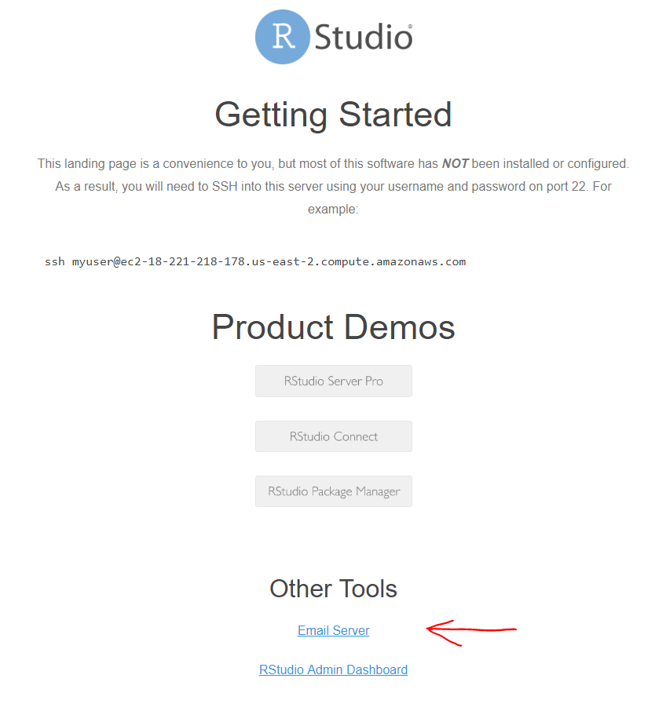
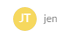
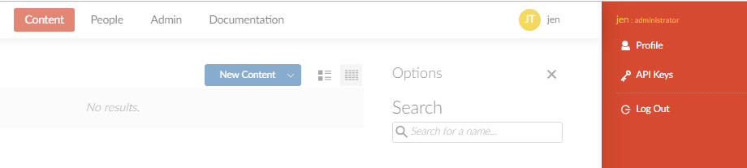

## Quiz


!!! question "Which authentication protocols are supported by RStudio Connect?"
    
    * Plain password
    * Proxy
    * PAM
    * LDAP
    * Google OAuth2
    * OAuth 2
    * SAML
    
??? example "Answer:"

    Plain password, proxy, PAM, LDAP, Google OAuth 2 amd SAML (supported since v1.7.4) are all supported.
    
    OAuth 2 is not currently supported, with the exception of the Google specific varient. Use proxy auth instead.
  
  
!!! question "Which of the following mail systems are supported by Connect?"
    
    * sendmail
    * SMTP
    * SendGrid
    

??? example "Answer:"

    Sendmail and SMTP

## Task: Edit Connect configuration file


### Configure server address


Task:

* Open the config file at `/etc/rstudio-connect/rstudio-connect.gcfg` with a text editor (e.g. `vi`)
* Edit the `[Server]` section to set the server adress to your machine name.

Important:

* For the purpose of this training session, use `http://` instead of `https://`.  (For a production server you must configure a SSL certificate!)
* The Connect instance in the classroom VM has been configured to listen at `/rsconnect`.  Make sure you append this string at the end of your server address.


```gcfg
[Server] 
Address = http://ec2-00-000-00-000.us-east-2.compute.amazonaws.com/rsconnect
```


### Screencast: Configure server address


<asciinema-player src="../../asciicast/edit-connect-config-1.cast"></asciinema-player>


### Task: Disable HTTP warning

It is possible to disable the HTTP warning.

(For your sanity during the course. Do not do this in production!)

`

```gcfg
[HTTP]
NoWarning
```


## Task: Configure email


### Configure email provider

Connect sends email for lots of things, so it is important to configure sending of mail correctly.

For this class, you will use the `RoundCube` mail engine that is pre-configured in the classroom virtual machine.  Remember that any email you send on this machine will be intercepted and will appear in your RoundCube inbox.

For full instructions about setting up email, refer to the admin guide, [Section 8: Email Setup](https://docs.rstudio.com/connect/admin/email)

Hint: the config file is at `/etc/rstudio-connect/rstudio-connect.gcfg`

```gcfg
[Server] 
EmailProvider = SMTP
SenderEmail = admin@localhost 
```

### Add SMTP settings

Review the section in the admin guide for SMTP email: [Appendices / Configuration / SMTP](https://docs.rstudio.com/connect/admin/appendix/configuration/#SMTP)

In your own organisation, you should speak to your email administrator to ensure you use the correct settings.

For the classroom virtual machine, use these settings to edit the Connect config file:

```gcfg
[SMTP] 
Host = localhost
Port = 25
startTls = never
```

* Save the settings.
* Restart the server.

```sh
sudo systemctl restart rstudio-connect
```


### Screencast: Configure email


<asciinema-player src="../../asciicast/edit-connect-config-2.cast"></asciinema-player>


## Task: Configure Authentication

### Choose LDAP authentication

Edit the `[Authentication]` section in the Connect configuration to use LDAP as authentication provider:

```gcfg
[Authentication]
Provider = LDAP
```

### Configure LDAP

It is helpful to add a `[Debug]` section to the Connect configuration to enable debug logging for LDAP:

```gcfg
[Debug]
Log = ldap
```

For the actual configuration, you can use the [complete configuration example in the admin guide](https://docs.rstudio.com/connect/admin/authentication/dap#openldap-example-with-bind-credentials) as starting point. Compare the LDAP structure provided in the admin guide with the one used on `leader.example.org` to determin the necessary changes.

Hint: You can get the LDAP structure for user `jen` with:

```sh
ldapsearch -w admin -h leader.example.org -p 389 -D cn=admin,dc=example,dc=org -b dc=example,dc=org cn=jen
```

Hint: It is enough to adjust `ServerAddress`, `BindDN`, `BindPassword` and `UserSearchBaseDN`.


## Task: activate your license

### Activate your license

In a production setting you must obtain a license key from RStudio before the evaluation period expires.

Review the [floating licenses](https://docs.rstudio.com/connect/admin/licensing/#floating-licenses) chapter in the Connect admin guide.

Your instructor set up a floating license server for this class. This server contains an activation key that is valid for the duration of this training class.

Tasks:

* Follow the instructions at [using floating licensing](https://docs.rstudio.com/connect/admin/licensing/#using-floating-licensing) to activate your license.
* Activate the floating license, using `leader.example.org:8999` as your `<server-hostname-or-ip>`
* Then restart Connect


```bash
sudo /opt/rstudio-connect/bin/license-manager license-server leader.example.org:8999
sudo systemctl restart rstudio-connect
```


### Screencast: Activate license


<asciinema-player src="../../asciicast/activate-connect-license.cast"></asciinema-player>


### Signs of success (licensing)

* After restarting Connect, query the license manager to check that you have an activated license.


```bash
sudo /opt/rstudio-connect/bin/license-manager status
```

If you activated the floating license correctly, you should see an active lease in the `-- Floating license status --` section:


```
-- Floating license status --

License-Server: leader.example.org:8999
Lease: Active
Users: 100
User-Activity-Days: 365
Shiny-Users: 100
Allow-APIs: 1
```


## Task: Get binary packages on Connect

### Reminder of binary packages

You have already configured RStudio Server Pro to install R packages from pre-compiled binaries from RStudio Package Manager.

You can get the same benefit of fast binary installs on RStudio Connect by setting an override switch on Connect.  When this is configured, Connect will ignore the `packrat` manifest file in the deployment bundle and attempt to install from the override repository instead.

To achieve this, you have to configure Connect to point to an instance of RStudio Package Manager.

Since you haven't yet configured RStudio Package Manager on your VM, you will temporarily point Connect to a demonstration instance of RStudio Package Manager at [demo.rstudiopm.com](https://demo.rstudiopm.com)

### Override the Package Repository

Read the [documentation](https://docs.rstudio.com/connect/admin/getting-started/#getting-started-rspm), then edit your Connect configuration file:

```gcfg
[RPackageRepository "CRAN"]
URL = "https://demo.rstudiopm.com/cran/__linux__/bionic/latest"
```

Then restart RStudio Connect.


## Reminder: Restart Connect

You should already have completed this step during license activation, but remember to restart Connect after [editing the configuration file](https://docs.rstudio.com/connect/admin/getting-started/#editing-config).


```sh
sudo systemctl restart rstudio-connect
```


## Reminder: Check the error log

After changing the Connect configuration settings, always remember to check the error log for any problems:

```sh
sudo tail /var/log/rstudio-connect.log
```


## Task: Create users on Connect


Now you can log into Connect and start to explore the system.

* Usually, for a default installation you must remember to add the `:3939` port
* However, for this classroom, we have a redirect, and instead of port 3939, you use the `/rsconnect` postfix to the url.
* Or simply click on the link from the classroom homepage.


### Task: Create admin user

* Create a new user by clicking on "Log In" and using one of the LDAP users


Remember:

* The first user you create on Connect is the admin user
* The Connect authentication mechanism is not necessarily tied to the authentication mechanism of RStudio Server Pro.
* However, it will make life easier if you use the same user name for your admin user than the user you are logged into on RStudio Server Pro.
* Concretely, this means that you should log in to Connect as `jen`
    


### Task: Send test email

* From the RStudio Connect Admin panel, click "Mail Settings" to access the email settings.  Although you can't edit settings from here, the admin user can view the settings, as well as send a test email.


* Send a test email.
* Remember that any email on this machine will appear in the RoundCube email client.
* To access your mailbox, click on the "Email Server" link in your workshop server page:




* If your email settings are correct, Connect will send a test email, and you can view this in Roundcube:


### Task: Impersonate a second user

In this task you impersonate a second user, to experience the workflow that a typical Connect user will follow to create an account.

* First, log out of Connect, by clicking on the user icon for jen 
* Then, on the expanded section, click "Log Out"





* Add a second user by clicking on "Log In" and using one of the LDAP users


* Check that the new user is not an administrator but has the viewer role.


## Config file cheat sheet

If you have trouble along the way, and want to compare your config file with a known good installation:

```gcfg
; RStudio Connect configuration file

[Server]
SenderEmail = admin@localhost
EmailProvider = SMTP

Address = http://ec2-00-00-00-00.us-east-2.compute.amazonaws.com/rsconnect

[SMTP]
Host = localhost
Port = 25
startTls = never

[HTTP]
Listen = :3939
NoWarning

[Authentication]
Provider = LDAP

[Licensing]
LicenseType = remote

[LDAP "Sample OpenLDAP Configuration"]
ServerAddress = leader.example.org:389
BindDN = cn=admin,dc=example,dc=org
BindPassword = admin
UserSearchBaseDN = dc=example,dc=org
UniqueIdAttribute = entryUUID
UsernameAttribute = uid
UserObjectClass = posixAccount
UserEmailAttribute = mail
UserFirstNameAttribute = givenName
UserLastNameAttribute = sn
```


## Signs of success

Upon completion of this exercise you have:


* A running instance of RStudio Connect
* Working email integration
* Multiple users
