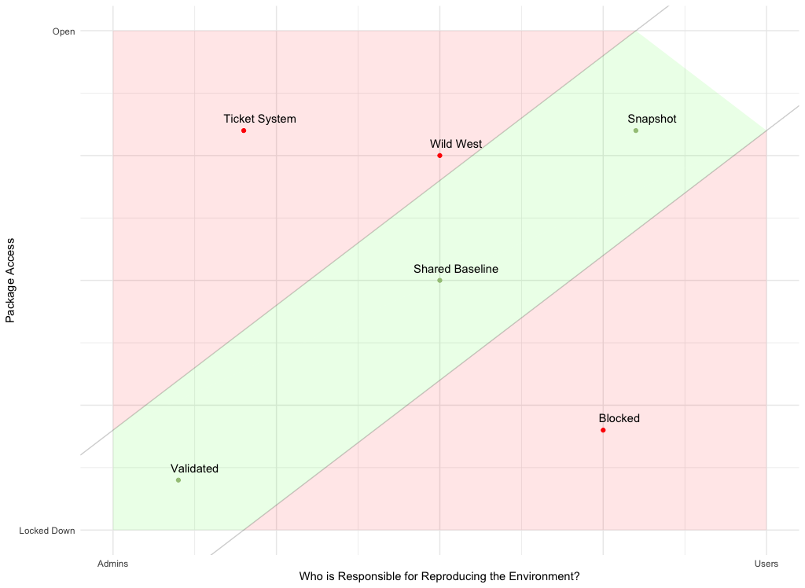

## Session overview

In this session, you will:

* Learn about different methods for configuring package repositories in RStudio
* Configure RStudio Workbench to point to RSPM package repository
* See how RSPM is used when publishing to RStudio Connect


## RSPM for end users

An administrator should work with end users to determine:

* Which RSPM repository they should use
* How they should configure and use repositories in their RStudio environments
* How to find and use the RSPM repository URL(s)
* Whether they want to use latest packages or fixed versions
* Whether they want to use binary or source versions

!!! note "Remember"
    Some businesses have rules about what software can be used within the organisation.
    RSPM can help you ensure those rules are followed.

Repositories in RStudio Package Manager are CRAN-like repositories, which means
users can access and install packages using their regular R functions:

* `install.packages()`
* `available.packages()`
* `packrat` and `renv`
* `devtools::install()`


!!! tip
    Users should use binary package installations from RSPM wherever possible to speed up deployment time.


### Connecting to RSPM repositories

Information on connecting to repositories:

* From the RSPM web interface, select a repository
* Navigate to the `Setup` tab
* Follow the steps to configure their RStudio environments with RSPM

Example: Using the latest packages from a repository:

* `http://{RSTUDIO-PM-ADDRESS}/{REPO-NAME}/latest`
* eg., `http://rstudio-pm.company.com/prod-cran/latest`

Example: Using binary packages from a fixed version of a repository:

* `http://{RSTUDIO-PM-ADDRESS}/{REPO-NAME}/__linux__/{LINUX-DIST}/{REPO-VERSION}`
* eg., `http://rstudio-pm.company.com/prod-cran/__linx__/binoic/131`
* `{LINUX-DIST}` is for the distribution on the server running RSP, not RSPM!


### Options for configuring repositories in RStudio

RSPM provides building blocks for configuring repositories and accessing packages. There are a spectrum of options that range from:

* An administrator assembles all packages and sources into a single repository, then sets this as only global option in RStudio Workbench
* An administrator configures multiple sources and repositories, then allows data scientists to set their own repositories as needed

Repositories can be configured in RStudio in different ways, for example:

* For a single user - Using `options()`
* For a single user - Setting `options()` in `.Rprofile`
* **For a single user - Setting repo(s) in RStudio IDE or RSP (RStudio 1.2+)**
* For all users - Setting repo(s) in `Rprofile.site`
* **For all users - Setting repo(s) in RSP `rsession.conf` globally**


### Configuring RSP 1.1 with RSPM for a single user

Steps for configuring RStudio Server Pro 1.1 with RSPM for a single user using
`.Rprofile`:

A sample `.Rprofile` file with two different package repositories:

```R
local({
  r <- getOption("repos")
  r["CRAN"] <- "https://cran.rstudio.com/"
  r["mycompany"] <- "http://rpackages.mycompany.com/"
  options(repos = r)
})
```

More details on configuring RStudio for different repositories are provided in the documentation on  [Package management in RStudio Connect](https://support.rstudio.com/hc/en-us/articles/226871467-Package-management-in-RStudio-Connect).

You can also set this globally for all users with `Rprofile.site`.

Or, you can set this for all users in the RStudio Server Pro configuration file, as shown below.


### Configuring RSP 1.2+ with RSPM for a single user

Steps for configuring RStudio Server Pro 1.2+ with RSPM for a single user:


> In RStudio 1.2 or above, repository settings are configured through the
`Global Options` menu available from the `Tools` section of the main toolbar.
In the `Packages` submenu, copy the repository URL into the "Primary CRAN repo"
field or click `Add` to include this repository as a secondary repo.


### Configuring RSP with RSPM for all users

In the RStudio Server Pro configuration file, `/etc/rstudio/rsession.conf`:

```sh
r-cran-repos=http://{RSTUDIO-PM-ADDRESS}/{REPO-NAME}/latest
```

Or for multiple repositories, use `/etc/rstudio/repos.conf`:

```sh
CRAN=https://<{RSTUDIO-PM-ADDRESS}/{CRAN-REPO-NAME}/latest
Internal=https://{RSTUDIO-PM-ADDRESS}/{INTERNAL-REPO-NAME}/latest
```

You can optionally discourage setting custom repositories in RStudio with the
following setting in `/etc/rstudio/rsession.conf`:

```sh
allow-r-cran-repos-edit=0
```

More details on configuring RStudio Workbench with RSPM are provided in the
documentation on
[Configuring RStudio Server](https://docs.rstudio.com/rspm/admin/rstudio-server.html).


### Publishing projects to RStudio Connect

If RStudio is configured with RSPM, then RStudio Connect will also retrieve
packages from RSPM when a project is published.


This means that the same versions of packages will be served from a centralized
source (RSPM) whether users are working in development or publishing to
production.


### Using RSPM with Docker for reproducibility

Docker can play an important role in creating reproducible environments, but
Docker alone is not sufficient to guarantee reproducibility.

Consider the following:

```docker
RUN Rscript -e 'install.packages(...)'
```

Each time a Docker image is rebuilt, the R command to install packages is
re-run, which can return different package versions and results over time.

Instead, replace the `install.packages(...)` command with a variation that uses
a fixed version of a repository in RStudio Package Manager.

For example:

```docker
FROM ubuntu

RUN apt-get install ...

RUN R -e 'install.packages(repos = "https://r-pkgs.example.com/cran/189")'

CMD <some process>
```


## Summary


### RStudio Package Manager overview

RStudio Package Manager allows you to:

* Organize packages in a central repository
* Perform automatic versioning of the entire repository
* Track package usage statistics and metrics
* Integrates with R, RStudio Workbench, and RStudio Connect
* Serve packages from
    * CRAN
    * Subset of CRAN packages
    * Local packages
    * Packages from Git


### Maintenance plan

* Verify and view repositories
* View package usage statistics
* Review package sync activity
* Explore package details and dependencies
* Inform users on how to get packages from RSPM


### Resources

RSPM Product Information: 

[https://www.rstudio.com/products/package-manager/](https://www.rstudio.com/products/package-manager/)

* Download evaluation
* Two-page Overview
* Architecture video
* Support articles

RSPM Documentation: 

* [https://docs.rstudio.com/rspm/admin/](https://docs.rstudio.com/rspm/admin/)

RSPM Webinar:

* [Introduction to RStudio Package Manager](https://resources.rstudio.com/webinars/introduction-to-the-rstudio-package-manager-sean-lopp)


FAQ:

* [https://docs.rstudio.com/rspm/admin/frequently-asked-questions.html](https://docs.rstudio.com/rspm/admin/frequently-asked-questions.html)

Support FAQ:

* [https://support.rstudio.com/hc/en-us/sections/360001622693-RStudio-Package-Manager](https://support.rstudio.com/hc/en-us/sections/360001622693-RStudio-Package-Manager)

Support Articles:

* [https://support.rstudio.com/hc/en-us/sections/360002093413-RStudio-Package-Manager](https://support.rstudio.com/hc/en-us/sections/360002093413-RStudio-Package-Manager)

Configuration and sizing recommendations:

* [https://support.rstudio.com/hc/en-us/articles/115002344588-Configuration-and-sizing-recommendations](https://support.rstudio.com/hc/en-us/articles/115002344588-Configuration-and-sizing-recommendations)


### Reproducing Environments: Strategies and Danger Zones

* Reproducing data science environments over time can be challenging, c.f. [environments.rstudio.com](https://environments.rstudio.com/)
* RSPM helps to implement different strategies
* Validated:
    - curated CRAN plus local packages
    - fixed snapshot
* Shared Baseline:
    - curated or full CRAN plus local packages
    - fixed snapshot
* Snapshot
    - curated or full CRAN plus local packages
    - snapshots and "latest"





| Label           | Description                                                             | Status |
|-----------------|-------------------------------------------------------------------------|--------|
| Validated       | Admins test and approve a subset of CRAN                                | TRUE   |
| Shared Baseline | 'All or most of CRAN, updated with R versions, tied to a system library | TRUE   |
| Wild West       | Open access, not reproducible, how we learn                             | FALSE  |
| Snapshot        | Open access, user or system records per-project dependencies            | TRUE   |
| Blocked         | Backdoor package access, offline systems without a strategy             | FALSE  |
| Ticket System   | Admins involved, no testing, slow updates, high risk of breakage        | FALSE  |


## Your turn


In the following exercise you'll configure RStudio Workbench to use RSPM as it's package source.

Signs of success:

* You understand the different methods of configuring RStudio to access packages from different repositories
* You have RStudio Workbench configured to obtain packages from RSPM
