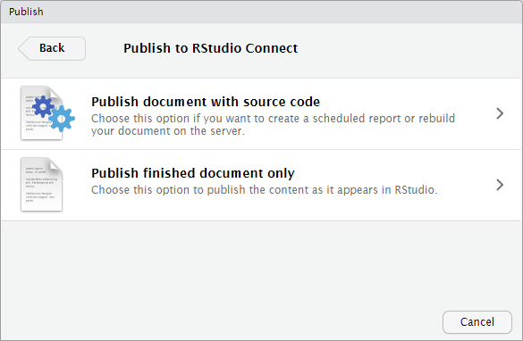

## In this session:

You will deploy and schedule reports in the form of R Markdown documents to RStudio Connect.

## R Markdown Reports

### Note for non-R users:

* [R Markdown](https://rmarkdown.rstudio.com/) is a form of literate programming, where you embed R code chunks into Markdown text
* This means you write the body of your document using markdown, with chunks of R interspersed in the markdown.
* During rendering of the report:
    - The **R code** chunks are **executed**
    - Any output from these chunks are rendered as **intermediate markdown** with embedded figures (for the plots)
    - Then this intermediate Markdown document is converted to the **final format**
* The final format is typically HTML, but it could also be PDF, Word or Powerpoint, among many other [formats](https://rmarkdown.rstudio.com/formats.html).

In essence, it's a powerful way to mix narrative text with code that renders out to a variety of popular and easy to distribute formats suitable for non-R-users.

### Solving the copy-and-paste nightmare

* One of the advantages of creating automated reports is that it shortens the cycle of content creation to content consumption.

* Rather than manually editing a report, then emailing the report, Connect lets you publish an HTML report, so you can share your work as a content URL.

### Rendering a report

* To create a report, press the "knit" button

<video width="100%" controls>
  <source src="https://cdn.rstudio.com/pro-admin/videos/knit.mp4" type="video/mp4">
</video>

### Deploying a report to Connect

When you deploy a report to Connect, you have choice between publishing:

* With source code
    - Giving you the option to schedule the report on Connect
    - This is the more flexible option!!!
* Final document only
    - This would effectively be a static report
 

### Deploying a report (with source code) to Connect

<video width="100%" controls>
  <source src="https://cdn.rstudio.com/pro-admin/videos/deploy_rmd_with_code.mp4" type="video/mp4">
</video>

### Refreshing a report from Connect, and viewing the history

* Connects keeps the rendered versions of a report, and allows you to manually trigger a referesh (if you published with source code!)

<video width="100%" controls>
  <source src="https://cdn.rstudio.com/pro-admin/videos/refresh_markdown.mp4" type="video/mp4">
</video>

### Other static content

Can Connect host other HTML, Word, PDF, content? 

* Yes, using the `rsconnect::deployDoc()` function

* As an admin you will probably not do this, but your R data scientists can use the `rsconnect` package to script deployments.

* See [rstudio.github.io/rsconnect/](https://rstudio.github.io/rsconnect/)

What about plots?

* Yes

Caveats:

* Only content generated from an R Markdown document can be emailed. 

## Parameterized Markdown

Parameterized reports allow users to specify some parameters to customize the analysis in a report.

References:

* Yihui Xie, "R Markdown, the definitive guide", [chapter 15](https://bookdown.org/yihui/rmarkdown/parameterized-reports.html)

* [R Markdown website](https://rmarkdown.rstudio.com/developer_parameterized_reports)

RStudio Connect recognizes parameterized Markdown and automatically creates an input pane.

### Knitting with parameters in the IDE

<video width="100%" controls>
  <source src="https://cdn.rstudio.com/pro-admin/videos/knitting_with_parameters.mp4" type="video/mp4">
</video>

### Parameterized Markdown in Connect

Collaborators and (optionally) viewers can create a new variant of a report. This lets non-R users create their own customized variants.

Private and public reports:

*  For whom:
    - Private : creator. 
    - Public: normal access control
* By who: collaborators

Scheduled and emailed reports:

*  Variants inherit all of the functionality of regular reports.

### Creating a variant parameterized Markdown in Connect

* Use the fly-out pane on the left to enter new parameters and save variants.

<video width="100%" controls>
  <source src="https://cdn.rstudio.com/pro-admin/videos/parameterized_report_connect.mp4" type="video/mp4">
</video>

## Scheduling

### Scheduling a report

If you deployed an R Markdown **with code** then you can:

* Schedule the report to run again
* Email the report

You can do this by changing settings in the "Schedule" tab

You can change:

* Schedule frequency
* Whether to republish the output
* Whether to send email, and the recipients

### Distribution permissions

**Collaborators can set up email to:**

| User type     | Action               |
| ------------- | -------------------- |
| Viewers       | Ad-hoc and Scheduled |
| Collaborators | Ad-hoc and Scheduled |
| Other Users   | Scheduled            |

**Viewers can send email to:**

| User type     | Action     |
| ------------- | ---------- |
| Themselves    | Ad-hoc     |

### A general purpose scheduler?

The idea that you can turn any R script into a scheduled report is very powerful.

Some possibilities:

* ETL (extract, transform, load)
* Perform a regular batch job
* Scrape data from website and store in a database
    - Assuming you have the legal permission to do so, of course!

### Can you give me the same report for XXX?

Create a second scheduled report for your favorite company…

….without leaving Connect

### Copy and paste nightmare revisited

### Deployment history

The report rendering history is retained for:

* Scheduled reports
* On-demand renderings
* Re-deploys (rendered and static content)

As the Connect sys-admin, you can configure how much history to keep

* See the [Jobs](https://docs.rstudio.com/connect/admin/appendix/configuration/#Jobs) section of the Admin guide.

## Email

### Emailing reports

RStudio Connect allows you to:

* customize whether or not an email is sent
* add email attachments
* specify the email subject line
* dynamically change the email messages
* include plots and tables in the email body

A convenient interface is the [blastula](https://rich-iannone.github.io/blastula/) package. For more information, read the corresponding [RStudio blog post](https://blog.rstudio.com/2019/12/05/emails-from-r-blastula-0-3/) and inspect the examples in the [Blastula Email Gallery](https://solutions.rstudio.com/examples/blastula-overview/)

### Further reading on email customization

Study the Connect **user guide** [Chapter 9: R Markdown](https://docs.rstudio.com/connect/user/rmarkdown/#r-markdown-email-customization), in particular:

* [Scheduling](https://docs.rstudio.com/connect/user/scheduling/)
* [Report history](https://docs.rstudio.com/connect/user/report-history/)
* [Output Metadata](https://docs.rstudio.com/connect/user/rmarkdown/#r-markdown-output-metadata)
* [Output Files](https://docs.rstudio.com/connect/user/rmarkdown/#r-markdown-output-files)
* [Resource Files](https://docs.rstudio.com/connect/user/rmarkdown/#r-markdown-resource-files)
* [Email Customization](https://docs.rstudio.com/connect/user/rmarkdown/#r-markdown-email-customization)
* [Simplifying HTML Email Creation with Blastula](https://docs.rstudio.com/connect/user/rmarkdown/#r-markdown-email-body-blastula)

## Databases and scaling

### Databases and scaling

How do you secure data access to databases from R Markdown?

* All the same rules apply as for Shiny
* Remember the advice at https://db.rstudio.com/best-practices/
  

Do you need to worry about scaling reports?

* No
* The reason is that R Markdown reports are static HTML, and is not expensive to serve

## Your turn

Next complete the exercise.

Signs of success:

* You deployed a Markdown report to Connect
* You created a scheduled update
* You triggered a run of the report and found the email in your Roundcube inbox
  
