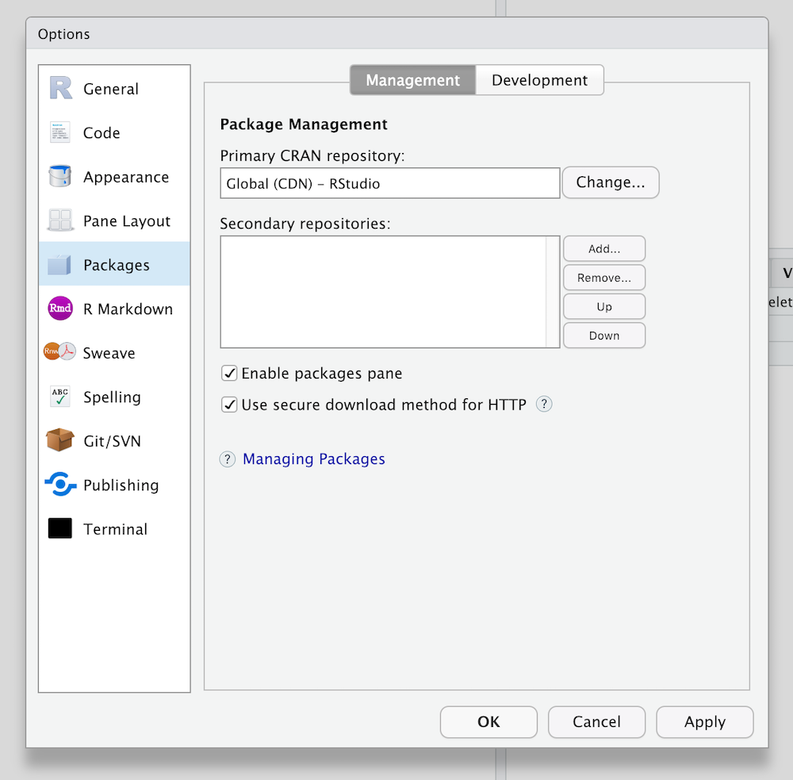

## Overview

In the following exercises, you will:

* Configure RStudio Server Pro to point to RSPM for a single user
* Install a package from a repository in RSPM
* Configure RStudio Server Pro to point to RSPM globally for all users
* Publish a project to RStudio Connect that fetches packages from RSPM

Refer to the  [RSPM Documentation](https://docs.rstudio.com/rspm/admin/) 
throughout the exercises, specifically the 
[Configuring RStudio Server](https://docs.rstudio.com/rspm/admin/rstudio-server.html) 
section.


## Task: View CRAN repository setting

1. Run the following in a Console in RStudio Server Pro:

```r
getOption("repos")
```

You should see output similar to the following:

```r
                      CRAN 
"https://cran.rstudio.com/" 
attr(,"RStudio")
[1] TRUE
```

2. In RStudio Server Pro, go to `Tools` > `Global Options` > `Packages` and view
the `Primary CRAN repository` that is currently set.



## Task: Configure packages for one user

As an end user, you can configure the RStudio IDE or RStudio Server Pro to point
to one or more repositories in RSPM.

In this exercise, you will configure projects for one user on your instance of
RStudio Server Pro to point to the CRAN repository in your RSPM instance.

1. Navigate to the web interface for your RSPM instance.

2. Choose the CRAN repository called `prod-cran`, then click on the `Setup` tab
in the top navigation bar, which will provide instructions for `Using Packages
Inside RStudio`.


3. Copy the `Repository URL`, which will appear similar to
`http://{IP-ADDRESS}/{REPO-NAME}/latest`
   
4. In RStudio Server Pro, go to `Tools` > `Global Options` > `Packages`.

5. Click on the `Change` button in the `Primary CRAN repository` setting.

6. In the `Choose Primary Repository` dialog, paste the repository URL into the
`Custom` field and click the `OK` button.


!!! note "Note"
    You can also click on the `Add` button in the `Packages` settings to include a repository as a secondary repository instead of the primary repository.


## Task: Install a new package from RSPM

You can install a new package in RStudio and verify that the new package is
being downloaded from the repository in RSPM.

1. In RStudio Server Pro, use the console to install a new package:

```r
install.packages("abind")
```

2. In the console logs, verify that the package is being downloaded from the
desired repository in RSPM.

```r
trying URL 'http://18.188.222.24:4242/prod-cran/latest/src/contrib/abind_1.4-5.tar.gz'
Content type 'application/x-gzip' length 21904 bytes (21 KB)
==================================================
downloaded 21 KB
```

3. In the RSPM web interface, navigate to the `prod-cran` repository that you
installed the package from, click on the `Packages` link in the top navigation
bar, open the details page for the `abind` package, and verify that the
`Monthly Downloads` count is greater than one.


## Task: Configure packages for all users

As an administrator, you can configure all users and projects to point to one or
more repositories in RSPM.

In this exercise, you will configure all users and projects on your instance of
RStudio Server Pro to point to the CRAN repository in your RSPM instance.

1. Open the RStudio Server Pro configuration file `/etc/rstudio/rsession.conf`
in a text editor.
   
2. Add a line similar to the following to the RStudio Server Pro configuration
file, replacing `{RSTUDIO-PM-REPO-URL}` with the repository URL for the
`prod-cran` repository in RSPM:
   
```sh
r-cran-repos={RSTUDIO-PM-REPO-URL}
```
   
3. Save the RStudio Server Pro configuration file, and restart RStudio Server
Pro using the following command:
   
```sh
sudo rstudio-server restart
```

Now, all users and projects will fetch packages from the repository in RSPM that
you've specified.

The documentation for 
[Configuring RStudio Server](https://docs.rstudio.com/rspm/admin/rstudio-server.html)
provides more details and describes additional scenarios for configuring RStudio 
Server Pro to point to repositories in RSPM.


## Task: Publish to RStudio Connect

Now that you've configured RStudio Server Pro to point to a repository in RSPM,
projects that are published to RStudio Connect will fetch packages from RSPM.

1. Open a project (or create a new project) in RStudio Server Pro
2. Publish the project to RStudio Connect

How can you confirm that the packages are being served from RStudio Package
Manager?

1. View the logs in RStudio Connect for the published asset
2. View the `Monthly Downloads` count for a package that is used in your project
3. View the usage statistics in RStudio Package Manager

Congratulations on completing the RSPM section of this training course!

## Bonus Task: Next steps with app_02

Previously you tried to deploy `app_02` from the course material to RStudio Connect. This failed since the `rstudiointernal` package was not available. Now you have the tools in place to build a proper solution.


* Follow the documented steps for [Distributing Local Packages](https://docs.rstudio.com/rspm/admin/quickstarts.html#quickstart-local) to add a new
repository that is subscribed to a local source package for `rsudiointernal`:

* Create a local source
* Add local package tar file to source
* Create a repository
* Subscribe the repository to the source

* Get the URL for the new repository from the web interface of RStudio Package Manager.

* Add the new repository as an additional one in RStudio Server Pro under `Tools` > `Global Options` > `Packages`.

* Try to publish `app_02` from before.

* In case of error, you can re-install the `rstudioninternal` package from the new repository using 

```r
install.packages("rstudiointernal")
```

Note that the app still does not work on RStudio Connect? Can you identify the issue?

As an alternative, you could also create a repository based on *both* CRAN and local source packages following the documented steps for 
[Distributing Local Packages along with CRAN Packages](https://docs.rstudio.com/rspm/admin/quickstarts.html#quickstart-local-and-cran). 
In that case you would have switched the main repository in RStudio Server Pro instead of adding an additional one.
